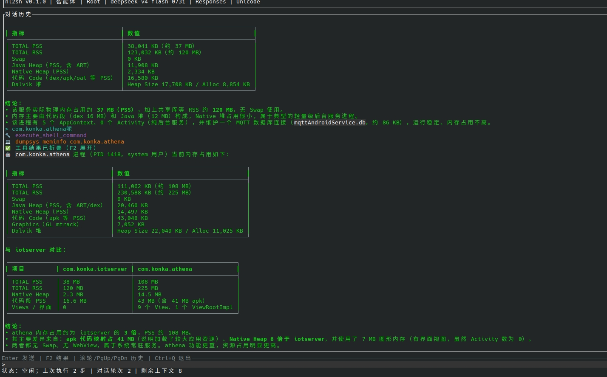

# nl2sh 用户使用说明

nl2sh 是 Android shell 版的类 Hermes AI Agent，通过丰富的终端界面用自然语言完成 Android 任务。核心程序只有一个可执行文件，运行在 Android 设备上，但需要从 Linux 或 Windows 电脑通过 ADB 启动。不需要安装 Rust、Android NDK 或 Termux。

## 1. 使用前准备

1. 在电脑上安装 Android SDK Platform-Tools，并确保命令行能运行 `adb`。
2. 在 Android 设备的“开发者选项”中开启“USB 调试”。
3. 用 USB 或网络 ADB 连接设备。设备弹出“是否允许 USB 调试”时，选择允许。
4. 在电脑上检查连接：

   ```text
   adb devices
   ```

   设备序列号后面显示 `device` 才表示已连接。如果显示 `unauthorized`，请解锁设备并允许调试授权。

## 2. 选择正确的压缩包

先运行：

```text
adb shell getprop ro.product.cpu.abi
```

- 输出 `arm64-v8a`：下载名称含 `aarch64-linux-android` 的 64 位压缩包。
- 输出 `armeabi-v7a`：下载名称含 `armv7-linux-androideabi` 的 32 位压缩包。

下载 `.zip` 或 `.tar.gz` 均可。解压后，请保持 `nl2sh` 和启动脚本在同一个文件夹中。

## 3. Linux 用户

打开终端，进入解压后的文件夹，运行：

```bash
chmod +x nl2sh android-run-linux.sh
./android-run-linux.sh
```

脚本会自动把 `nl2sh` 复制到设备并启动。

## 4. Windows 用户

在解压后的文件夹空白处按住 Shift 并单击鼠标右键，选择“在终端中打开”或“在此处打开 PowerShell”，然后运行：

```powershell
.\android-run-windows.ps1
```

请使用 PowerShell，不要双击 `.ps1` 文件，也不需要 WSL。

## 5. 首次启动

首次启动会直接进入 nl2sh TUI，不会自动打开配置向导。请在输入框使用 `/config` 完成全部配置，也可以先用 `/provider` 配置 API 服务，再用 `/model` 单独配置模型。完成配置前，普通任务不会发送给模型。

- 输入任务后按 Enter，例如：`查看当前内存使用情况`。
- 修改设备的命令需要用户确认；高危命令需要二次确认。请仔细阅读命令再同意执行。
- 输入 `/help` 可显示操作帮助。
- 输入 `/clear` 可清空当前会话的对话、模型上下文和输入历史；JSONL 审计日志不会删除。
- 输入 `/config` 可修改 AI 服务配置。
- 输入 `/provider` 可配置 API Endpoint、API Key 和 API 类型。
- 输入 `/model` 可单独配置模型名称。
- 按 F2 展开或收起命令输出。
- 鼠标滚轮或 PageUp/PageDown 可浏览对话；复制文字时按住 Shift 拖选，再使用右键菜单复制。
- 输入框支持闪烁光标、方向键定位和当前会话输入历史；输入 `/` 会显示可选命令。
- 按 Ctrl+C 取消当前任务，按 Ctrl+Q 退出。

例如输入“查看当前内存使用情况”，界面会实时展示命令执行输出与 Agent 的最终结果：



## 6. 常见问题

### 提示找不到 adb

说明 Android SDK Platform-Tools 没有安装，或者 `adb` 所在目录没有加入 PATH。安装后重新打开终端，确认 `adb version` 能正常输出版本。

### `adb devices` 没有设备

- 检查 USB 线是否支持数据传输，并确认 USB 调试已开启。
- 在 Windows 上安装设备厂商的 ADB/USB 驱动。
- 尝试运行 `adb kill-server`，然后运行 `adb start-server` 并重新连接。

### 显示 `unauthorized`

解锁 Android 设备，接受 USB 调试授权。如果没有弹窗，在开发者选项中撤销 USB 调试授权，再重新连接。

### 提示有多个设备

先用 `adb devices` 查看序列号，再指定要使用的设备：

Linux：

```bash
ADB_SERIAL=设备序列号 ./android-run-linux.sh
```

Windows PowerShell：

```powershell
$env:ADB_SERIAL = "设备序列号"
.\android-run-windows.ps1
```

### Windows 禁止运行 PowerShell 脚本

可以只为当前 PowerShell 窗口允许脚本，关闭窗口后设置失效：

```powershell
Set-ExecutionPolicy -Scope Process Bypass
.\android-run-windows.ps1
```

### 提示 `No such file or directory`，但 nl2sh 明明存在

通常是下载了错误的 32/64 位压缩包。重新运行 `adb shell getprop ro.product.cpu.abi`，并按第 2 节下载对应的包。

### 提示 `adb root is unsupported` 或 root 被拒绝

这在零售设备上很常见，不一定是错误。脚本会继续尝试 `su`；如果设备没有 root，则以 adb shell 用户运行。没有 root 时，部分系统命令无权执行。

### 无法读取 `config.toml`

如果以前用 root 启动过，配置文件可能只允许 root 读取。请恢复 root/su 后再启动，或在确认不再需要旧配置后手动备份并删除设备上的 `/data/local/tmp/config.toml`，然后重新配置。配置中包含 API Key，不要随意放宽文件权限。

### 启动后无法请求 AI 服务

检查 Android 设备是否能访问网络，并核对 API Key、Base URL、模型名称和 API 类型。可在 nl2sh 中输入 `/config` 重新配置。
